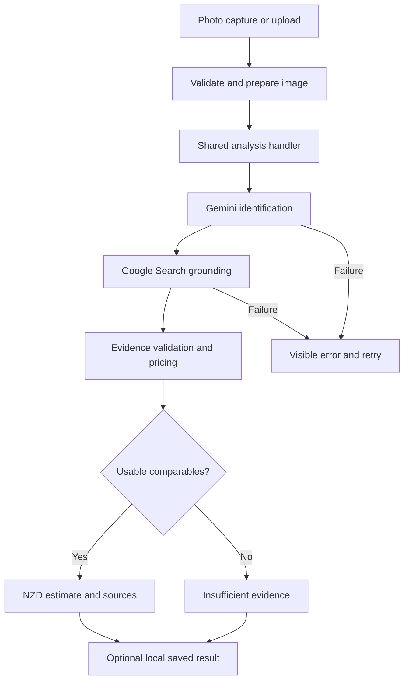

# PriceSnap architecture — engine 1.1.0

## Components

| Component | Responsibility |
|---|---|
| React/Vite PWA | Capture/upload, display progress and results, save locally |
| `src/services/image.ts` | Resize uploaded images, JPEG encoding, client size/type feedback |
| `src/services/analyze.ts` | Single-image request, JSON/NDJSON response parsing |
| `src/store.tsx` | Navigation, cancellation, retry, saved history, theme |
| `server/analyze.ts` | Shared input validation, errors, streaming, deadlines, safe logs |
| `server/app.ts`, `server.ts` | Express routes, dev Vite middleware, production static frontend |
| `api/*.ts` | Vercel Node request/response adapters using the same handler |
| `src/lib/valuation-engine` | Identification, grounded evidence, deterministic valuation |
| Google Gemini | Image identification and Google Search-grounded discovery |

## Request lifecycle

The browser sends one `image` value, requesting NDJSON. The handler validates base64, image signature, MIME and maximum size before invoking the engine. The engine emits `identifying`, `searching` and `calculating` when those stages start. These are actual stage events, not invented percentages. The final stream record contains a result or error.

Clients not requesting NDJSON receive the normal JSON API. Express and Vercel use the same handler, including the `/api/pricesnap` compatibility alias. Vercel functions use the Node request/response contract, not a mixed Edge/Web Request handler.

One server request has a 90-second abort deadline; SDK requests have a 45-second HTTP timeout; the browser stops waiting after 100 seconds. The Vercel functions request a 120-second platform maximum. Client disconnects propagate an abort signal. No image-bearing background job survives the request intentionally.

## Data and security boundaries

- API keys are read only on the server. They must never be `VITE_` variables.
- Identification receives the image. Search receives item attributes, not the image.
- Source URLs are not fetched by PriceSnap. Provider citation URLs must pass HTTPS validation. Links open with `noopener noreferrer`.
- Google search-suggestion HTML is displayed inside a sandboxed iframe without script or same-origin permissions.
- Application logs contain ID/status/error code/count/duration, never the image, API key or raw provider error text.
- Original photos are held transiently in browser/server memory. Results are stored only after Save Result in `pricesnap_history_v1`, capped at 50. The browser also stores theme preferences.
- Clear saved results removes local result storage. No cross-device or Google-side deletion is implied.
- API responses use `Cache-Control: no-store`; service-worker API requests are network-only.
- Frontend assets are in `dist/`; the server bundle is in `build/` and is not served as a public asset.

## Runtime boundaries

The engine's dependency parameter is an internal test seam. Production routes always use Gemini. Fixture responses live only under `tests/`; there is no production mock flag, fixture endpoint or offline appraisal fallback. The PWA can cache its shell, but new valuations require connectivity.
