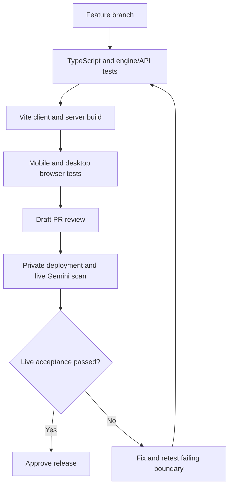

# Build, verification and release pipeline

The npm lockfile is authoritative. Use `npm ci` for repeatable dependencies. `bun.lock` is historical and is not used by CI.

## Commands

- `npm run lint`: TypeScript checking.
- `npm test`: Node test runner with tsx import hook. Tests engine, evidence safety, request validation, errors, JSON/NDJSON parity and Gemini SDK transport with controlled provider responses.
- `npm run build`: Vite assets to `dist/`, server bundle to `build/`.
- `npm run check`: all three above.
- `npx playwright install --with-deps chromium`: browser setup for CI/developer machines.
- `npm run test:e2e`: Chromium mobile and desktop flows against the built app and a test-only fixture server. Build first.
- `PLAYWRIGHT_CHROMIUM_EXECUTABLE=/absolute/path/to/chromium npm run test:e2e`: use an installed compatible Chromium when the default browser download is unavailable.

Provider fixtures never activate in the production app. Browser tests exercise real capture upload preparation, fetch/stream handling, engine calculation, result rendering and saved-history interactions while replacing external AI outputs. They do not measure live model accuracy or source freshness.

GitHub CI checks Node 20 and 22, engine/API tests and production artifacts. Browser checks run on Node 22. The separate existing Cloud Run workflow deploys main after its build/test checks when GCP secrets are configured. A feature-branch PR does not require merging or deploying production.
